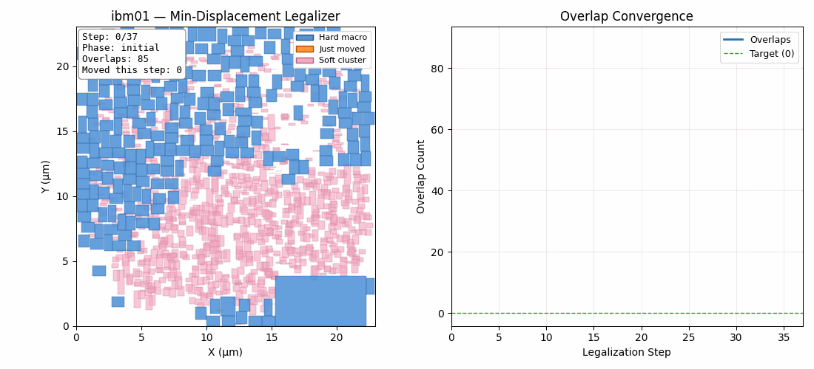

# Min-Displacement Legalizer — Macro Placement Challenge 2026

**Team Jiangban Ya** · Kevin (Haochuan) Wang · `hcw@mit.edu`

Most teams treated the challenge as "optimize, then legalize." We inverted the pipeline: the IBM benchmarks' hand-crafted initial layouts already have strong wirelength, density, and congestion — so re-optimizing from scratch risks destroying quality that's already there. Our placer never moves a macro unless it has to.

<p align="center">
  <br>
  <em>ibm01 — resolving 85 hard-macro overlaps with minimum-displacement shifts. Avg proxy cost 1.0891, ~20s runtime.</em>
</p>

**What's in the frame:**
- **Hard macro** (blue): the large fixed-size blocks we're placing — SRAMs, IPs, analog blocks. These are the only objects the algorithm moves.
- **Just moved** (orange): a hard macro that was shifted in the current legalization step (greedy pair resolution or spiral search).
- **Soft cluster** (pink): pre-placed standard-cell clusters. Static scenery — we don't move them, but hard macros must not overlap them.
- **Overlap Convergence** (right): number of hard-macro pairs still overlapping. The legalizer terminates when this hits zero.

**Pipeline:** (1) multi-pass greedy pair-wise overlap resolution via minimum-displacement vectors, (2) proxy-aware spiral search that re-evaluates only the nets touching the moved macro, (3) "make-room" pass that temporarily displaces smaller blockers for large macros, (4) swap fallback when local resolution stalls.

**Result:** avg proxy **1.4944** across all 17 IBM benchmarks (~2.5% better than RePlAce), zero overlaps, ~188s avg per benchmark — pure NumPy, no learning, no external solver.

### Architecture

```
placer.py          Main entry point (MinDispLegalizer class)
legalizer_v3.py    Core legalization algorithm (911 lines)
```

## How to Run

Place both `placer.py` and `legalizer_v3.py` in your submission directory
(e.g., `submissions/our_team/`), then:

```bash
# Single benchmark
uv run evaluate submissions/our_team/placer.py -b ibm01

# All 17 benchmarks
uv run evaluate submissions/our_team/placer.py --all
```

## Results

Average proxy cost across 17 IBM benchmarks: **1.4944**
(Proxy = 1.0 * Wirelength + 0.5 * Density + 0.5 * Congestion)

| Benchmark | Proxy  | WL    | Density | Congestion | Time (s) |
|-----------|--------|-------|---------|------------|----------|
| ibm01     | 1.0891 | 0.067 | 0.858   | 1.186      |    19.9  |
| ibm02     | 1.5892 | 0.076 | 0.756   | 2.270      |  1269.1  |
| ibm03     | 1.3304 | 0.080 | 0.742   | 1.759      |    18.7  |
| ibm04     | 1.4576 | 0.078 | 0.983   | 1.775      |    37.2  |
| ibm06     | 1.7029 | 0.064 | 0.785   | 2.494      |   622.8  |
| ibm07     | 1.4826 | 0.065 | 0.834   | 2.001      |     7.5  |
| ibm08     | 1.5547 | 0.069 | 0.890   | 2.081      |    13.7  |
| ibm09     | 1.1527 | 0.058 | 0.886   | 1.304      |    20.4  |
| ibm10     | 1.3768 | 0.071 | 0.694   | 1.919      |    12.4  |
| ibm11     | 1.2319 | 0.054 | 0.885   | 1.470      |    23.7  |
| ibm12     | 1.8099 | 0.061 | 0.936   | 2.562      |    91.6  |
| ibm13     | 1.3909 | 0.054 | 0.898   | 1.776      |   102.6  |
| ibm14     | 1.5957 | 0.052 | 0.967   | 2.120      |   120.5  |
| ibm15     | 1.6033 | 0.058 | 0.932   | 2.158      |    94.8  |
| ibm16     | 1.4995 | 0.049 | 0.836   | 2.064      |    40.1  |
| ibm17     | 1.7411 | 0.054 | 0.949   | 2.426      |   667.3  |
| ibm18     | 1.7957 | 0.053 | 1.048   | 2.436      |    40.9  |
| **AVG**   |**1.4944**| 0.063 | 0.876 | 1.988      |   188.4  |

All placements are valid (zero hard macro overlaps, all macros within canvas bounds).
Average runtime: 188.4s per benchmark. Max: 1269s (ibm02).

## Dependencies

Beyond the base challenge repository:
- numpy
- torch
- (standard library: itertools, collections, pathlib, sys)

## License

Apache License 2.0
