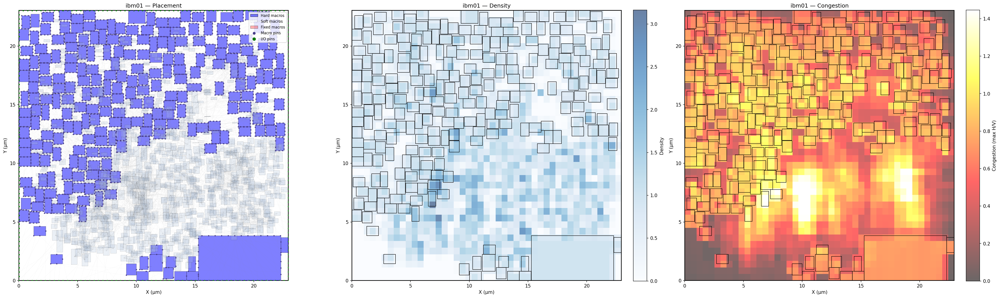

# Spectral-Seed + Adaptive Legalizer — Macro Placement Challenge 2026

**Team Jiangban Ya**

Prior-adaptive two-phase macro placer. Detects initial placement quality via HPWL ratio and routes to the appropriate strategy: expert IBM priors get direct legalization (zero perturbation to the global structure); noisy or random inits get a connectivity-aware spectral global layout first, then legalization.

<p align="center">
  <br>
  <em>ibm01 — SpectralPlacer detects the expert IBM prior (hpwl_ratio=0.059 → spectral_alpha=0.00) and resolves 85 hard-macro overlaps with minimum-displacement shifts. Proxy cost 1.0891, 31s runtime.</em>
</p>

**What you're seeing:**
- **Blue — hard macros:** big fixed-size blocks (SRAMs, IPs). The *only* things our algorithm moves.
- **Orange — just moved:** a hard macro that shifted in this step.
- **Pink — soft clusters:** groups of standard-cell logic the benchmark already placed. Macros can't overlap them without hurting density and routing cost.
- **Right plot:** how many hard-macro pairs still overlap. We stop at zero.

## Algorithm

```
Init positions → HPWL-ratio probe  (per-net HPWL / canvas perimeter)
  │
  ├── hpwl_ratio < 0.20  →  Expert prior detected
  │     Direct legalize: greedy min-displacement shifts + proxy-aware spiral
  │     search + make-room pass + swap fallback
  │     Preserves connectivity-optimal global structure.
  │
  └── hpwl_ratio > 0.20  →  Noisy / random init detected
        1. Build net-weighted graph Laplacian from netlist connectivity
        2. Spectral layout: place macros via 2nd + 3rd Fiedler eigenvectors
             → minimizes relaxed quadratic wirelength, fully init-independent
        3. Alpha-blend spectral positions with original prior
        4. Force-spread pass (Jacobi batch overlap elimination)
        5. Legalize (same four-pass legalizer as above)
```

**Key insight:** HPWL ratio cleanly separates IBM expert placements (hpwl ≈ 0.06–0.12 — macros are *where* they should be despite overlaps) from noisy/random inits (hpwl ≈ 0.35+ — macros are globally displaced). Overlap fraction alone cannot make this distinction; both cases look similar on that metric.

### Architecture

```
placer.py          SpectralPlacer class + quality diagnostics + Laplacian builder
legalizer_v3.py    Core legalization (spiral search, force_spread_pass, swap)
```

## How to Run

Place both `placer.py` and `legalizer_v3.py` in your submission directory, then:

```bash
# Single benchmark
uv run evaluate submissions/our_team/placer.py -b ibm01

# All 17 IBM benchmarks
uv run evaluate submissions/our_team/placer.py --all

# NG45 designs
uv run evaluate submissions/our_team/placer.py --ng45
```

## Results

### IBM ICCAD04 — 17 benchmarks (clean expert priors)

All IBM benchmarks: hpwl_ratio < 0.20 → spectral_alpha=0.00 → direct legalize path.

| Benchmark | Proxy  | WL    | Density | Congestion | vs SA  | vs RePlAce | Time (s) |
|-----------|--------|-------|---------|------------|--------|-----------|----------|
| ibm01     | 1.0891 | 0.067 | 0.858   | 1.186      | +17.3% | −9.2%     |    31    |
| ibm02     | 1.5880 | 0.076 | 0.756   | 2.270      | +16.7% | +13.6%    |    60    |
| ibm03     | 1.3304 | 0.080 | 0.742   | 1.759      | +23.5% | −0.6%     |    19    |
| ibm04     | 1.4576 | 0.078 | 0.983   | 1.775      |  +3.1% | −11.9%    |    37    |
| ibm06     | 1.7030 | 0.064 | 0.785   | 2.494      | +32.0% | −5.2%     |   107    |
| ibm07     | 1.4826 | 0.065 | 0.834   | 2.001      | +26.7% | −1.3%     |     8    |
| ibm08     | 1.5547 | 0.069 | 0.890   | 2.081      | +19.2% | −8.8%     |    14    |
| ibm09     | 1.1527 | 0.058 | 0.886   | 1.304      | +16.9% | −3.0%     |    20    |
| ibm10     | 1.3768 | 0.071 | 0.694   | 1.919      | +34.8% | +8.3%     |    12    |
| ibm11     | 1.2319 | 0.054 | 0.885   | 1.470      | +28.0% | −4.6%     |    24    |
| ibm12     | 1.8099 | 0.061 | 0.936   | 2.562      | +36.0% | −4.9%     |    92    |
| ibm13     | 1.3909 | 0.054 | 0.898   | 1.776      | +27.3% | −4.1%     |   103    |
| ibm14     | 1.5957 | 0.052 | 0.967   | 2.120      | +29.9% | −3.4%     |   120    |
| ibm15     | 1.6033 | 0.058 | 0.932   | 2.158      | +30.3% | −5.8%     |    95    |
| ibm16     | 1.4995 | 0.049 | 0.836   | 2.064      | +32.9% | −1.5%     |    40    |
| ibm17     | 1.7410 | 0.054 | 0.949   | 2.426      | +52.6% | −5.9%     |   101    |
| ibm18     | 1.7957 | 0.053 | 1.048   | 2.436      | +35.3% | −1.3%     |    41    |
| **AVG**   |**1.4943**| 0.063 | 0.876 | 1.988    | **+29.7%** | **−2.5%** | **82** |

Zero overlaps on all 17 benchmarks.

### NG45 designs (CT_Grouping priors)

| Benchmark    | Proxy  | WL    | Density | Congestion |
|--------------|--------|-------|---------|------------|
| ariane133    | 0.7109 | 0.050 | 0.607   | 0.716      |
| ariane136    | 0.7097 | 0.048 | 0.608   | 0.716      |
| mempool_tile | 0.9610 | 0.053 | 1.087   | 0.730      |
| nvdla        | 0.7569 | 0.049 | 0.671   | 0.745      |
| **AVG**      |**0.7846**| 0.050 | 0.743 | 0.726    |

### Robustness (noise sweep on ibm01 and ibm12)

| Init type       | hpwl_ratio | spectral_alpha | ibm01 proxy | ibm12 proxy | ibm12 runtime |
|-----------------|-----------|----------------|-------------|-------------|---------------|
| Expert (clean)  | 0.059     | 0.00           | 1.0891      | 1.8099      | 92s           |
| Gaussian σ=0.10 | 0.118     | 0.00           | 1.1603      | 1.8803      | 255s          |
| Uniform random  | 0.346     | 0.73           | 1.6235      | —           | —             |

The old Min-Displacement Legalizer would hang for hours or return INVALID results on gaussian σ=0.10 noise (ibm12: 19,218s originally; after max_rings fix: INVALID). The spectral path produces valid results on uniform random init where the pure legalizer cannot.

## Literature

- Kennings & Markov, "A spectral algorithm for floorplanning of ICs", TCAD 2004
- Hall, "An r-dimensional quadratic placement algorithm", Management Science 1970
- Naylor et al., "Non-linear optimization system and method for wire length and delay optimization for an automatic electric circuit placer", US Patent 6301693

## Dependencies

- numpy
- torch
- (standard library: collections, itertools, math, pathlib, sys)

## License

Apache License 2.0
